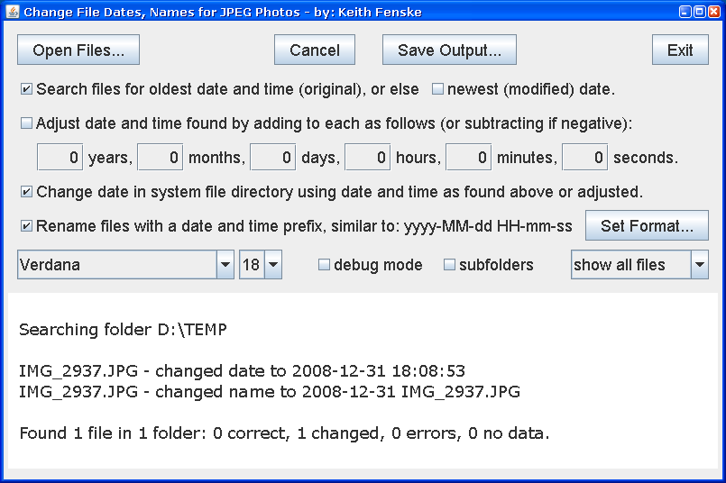

### Redate Photo File (Java)

by: Keith Fenske, https://kwfenske.github.io/

RedatePhotoFile is a Java 1.4 application to change file names or the "last
modified" date in the system file directory for JPEG photo files, using an
embedded date and time found within most JPEG files. The oldest date in a JPEG
file is usually the original image creation date. A newer date is often from
editing.

Download the ZIP file here: https://kwfenske.github.io/redate-photo-file-java.zip

Released under the terms and conditions of the Apache License (version 2.0 or
later) and/or the GNU General Public License (GPL, version 2 or later).

